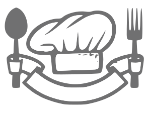

[Source](https://www.svgimages.com/chef-materials.html)

# Chef

My motivation for creating Chef was to build a web server in Go for storing
recipes.

The server is mostly complete and there is a bare-bones client that can connect 
to it, but it still needs some UI to round it out.

## Getting started

Clone the repo:

```sh
git clone git@github.com:neil-berg/chef.git
```

Spin up the cluster:

```sh
# Make sure you have docker and docker-compose installed!
make up

# Or build and bring up manually:
docker-compose build 
docker-compose up -d
```

Note that the cluster relies on several environmental variables expected in a
file called `.env` in the root directory. So you need to copy `example.env` to
`.env` and adjust the varibales if needed for your setup:

```sh
cp example.env .env
```

Bring down the cluster:

```sh
make down

# Or manually:
docker-compose down 
```

## Server

This REST server uses [Gorilla Mux](https://github.com/gorilla/mux) as its 
foundation, which builds upon the standard Go library's `http.ServeMux`. 

### Routes

Simple CRUD'ing of recipes and users:

| Method  | Route         | Authenticated | Description |
| ------- | -----------   | :-----------: | ----------- |
| POST    | /signup       | ❌  | Create a new user in the DB with username/password
| POST    | /signin       | ❌  | Validates username/password and refreshes JWT
| POST    | /auth/me      | ✅  | Determines if the user is authenticated or not based on a valid token
| DELETE  | /me/delete    | ✅  | Removes the user from the DB
| GET     | /recipes/{ID} | ✅  | Read one recipe by its ID from the DB
| GET     | /recipes      | ✅  | Reads all recipes for the user from the DB
| POST    | /recipes/add  | ✅  | Adds one recipe to the DB
| PUT     | /recipes/{ID} | ✅  | Updates one recipe from the DB
| DELETE  | /recipes/{ID} | ✅  | Removes one recipe from the DB


### Database

Postgres is used at the store for this app with [gorm](https://gorm.io/) as the 
ORM. GORM's `DB` struct is embedded into the server's `handler` struct, so that 
any handler has access to the DB methods.

```go
type Handler struct {
	logger *log.Logger
	db     *gorm.DB
	config *cfg.Config
}
```

### Tokens

JSON Web Tokens (JWTs) are used for authenticating users. The token is created
upon user creation or refreshed when a user signs in and is sent back as an HTTP-
only cookie in the response for future authenticated requests.

### CORS

Allowed origins are specified by the environmental variable `CLIENT_URL`, which
defaults to `http://localhost:9090` for local development.

## Client (more details to come!)

The app's client is written in React/Typescript with Redux as its client-side
store and Styled Components for its styling. 

